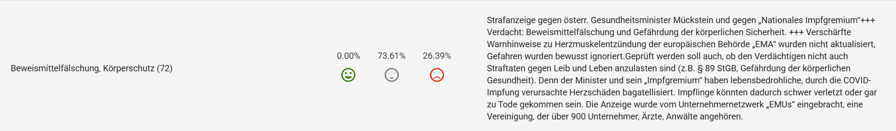
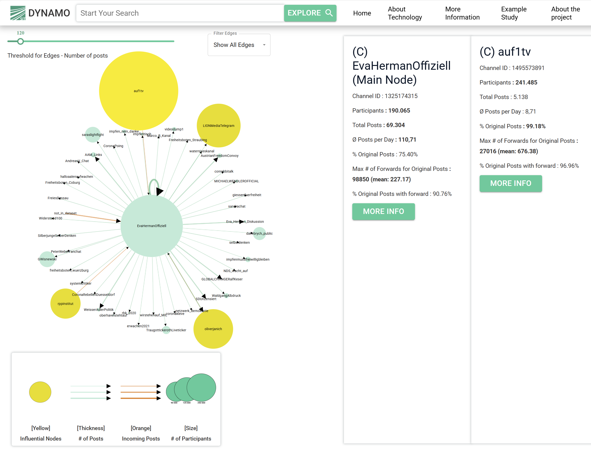
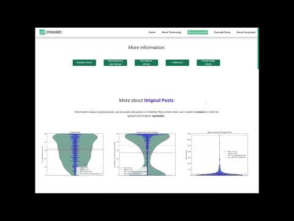

# demo_telegram_visualization
This is a repo for describing a demo.

## Video

## More technical details:

### Metadata  Analysis
See our paper: 
1. [Transparency in Messengers](https://doi.org/10.1145/3603163.3609034)
2. [Scientific Appearance in Telegram](http://dx.doi.org/10.1609/icwsm.v18i1.31451)
3. [Creating Visual Persona Profiles in Telegram using NLP](http://dx.doi.org/10.2352/ei.2024.36.1.vda-359)

Papers in German:
1. Desinformation in Messenger-Diensten: Aktuelle Herausforderungen &amp; Handlungsempfehlungen für rechtliche und gesellschaftliche Maßnahmen: [link](https://doi.org/10.17185/duepublico/82406)
2. Desinformationserkennung anhand von Netzwerkanalysen – ein Instrument zur Durchsetzung der Pflichten des DSA am Beispiel von Telegram: [link](https://doi.org/10.5771/9783748938743-343)

### Content Analysis
1. **Topic Modelling**: we used BERTopic as a topic modeling approach, and SentenceTransformer `all-MiniLM-L6-v2` as embedding. For channels/groups with large amount of posts, we randomly selected 10000 posts for topic modeling. Moreover, we only considered texts that have more than 6 words. Due to efficiency/runtime reasons, we used UMAP `umap.UMAP(n_neighbors=10, n_components=5, metric="cosine")` and HBDSCAN `hdbscan.HDBSCAN(min_cluster_size=2, min_samples=1)`. For **generating the name of the topic**, we took the representative post(text) and used `microsoft/Phi-3.5-mini-instruct` to let it generate suitable topic to the representative post.
2. **Sentiment Analysis**: Since the dataset consists mostly of German posts we used [germansentiment](https://huggingface.co/oliverguhr/german-sentiment-bert)
